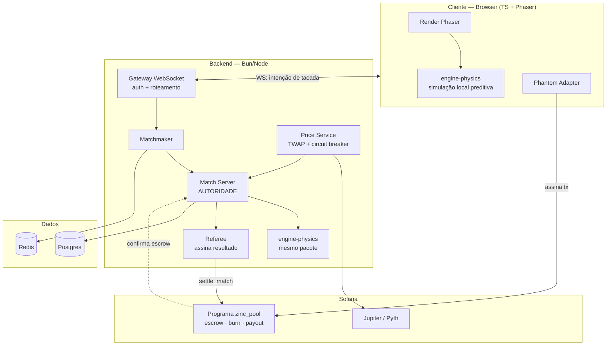
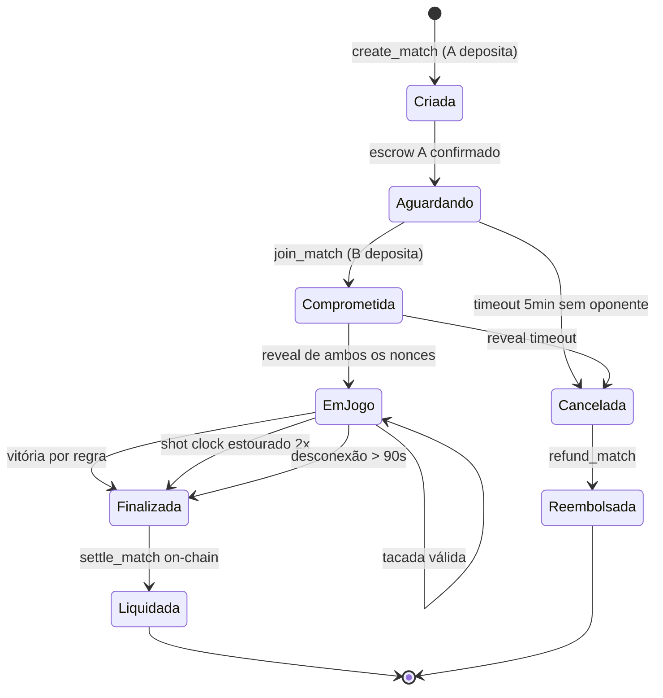
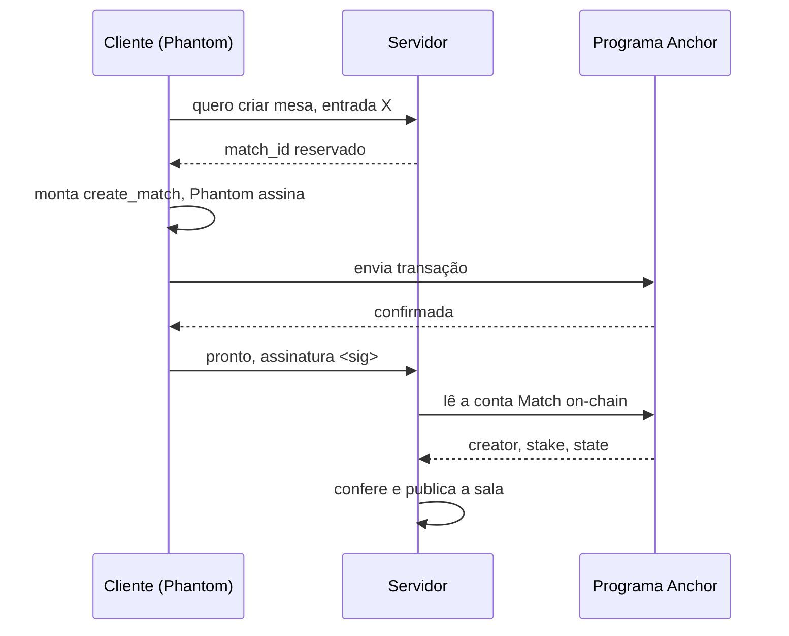
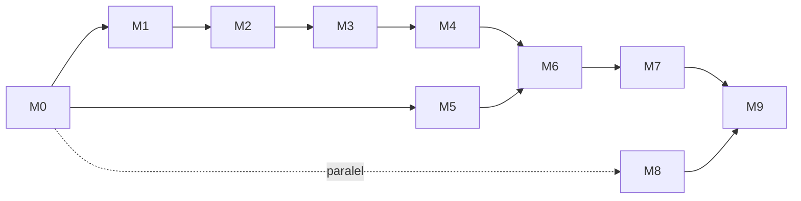

# ZINC Pool — Technical Design Document

**Versão:** 0.1 (draft)
**Data:** 2026-08-06
**Escopo deste documento:** MVP com mesa apostada em ZINC (Solana), cliente web em TypeScript + Phaser.

---

## 1. Visão

Sinuca 8-Ball 1v1, turno a turno, com aposta em ZINC travada em escrow on-chain. O vencedor leva 90% do pote, 5% é queimado e 5% vai para o cofre da casa.

O produto é composto de três sistemas que falham por motivos independentes e por isso são projetados separadamente:

| Sistema | Falha se | Autoridade |
|---|---|---|
| **Simulação** | jogador forja resultado | Servidor (física determinística) |
| **Liquidação** | fundos travam, pagam errado, ou pagam duas vezes | Programa Anchor |
| **Precificação** | preço do ZINC é manipulado na hora da entrada | Oracle + TWAP + circuit breaker |

Nenhum desses três confia no cliente para nada.

---

## 2. Objetivos e não-objetivos do MVP

### Objetivos

1. Um jogador **cria uma sala** definindo o valor da entrada (acima de um mínimo configurável, `MIN_STAKE`, e abaixo de `MAX_STAKE`) e deposita. Um segundo jogador entra depositando exatamente o mesmo valor. Os dois jogam uma partida completa de 8-Ball e **o vencedor leva o pote** automaticamente, sem clique de saque.
2. A física roda no servidor. O cliente nunca reporta resultado.
3. Abandono e timeout resultam em pagamento automático ao adversário, sem intervenção manual.
4. Todo pote entra e sai do escrow com invariante contábil verificável on-chain.
5. Replay de qualquer partida é reproduzível bit-a-bit a partir de `(seed, lista de tacadas)`.

### Não-objetivos (fora do MVP — não implementar, não deixar hook)

Rei da Mesa · torneios · mesas privadas · battle pass · lootbox · fragmentos · marketplace de tacos · aluguel de NFT · clãs · staking/xZINC · skins · upgrade de taco.

> Cada um desses tem superfície de fraude própria. Entram só depois que a mesa de $1 estiver estável em produção.

### Restrições assumidas

- **Web-first.** Não vai para App Store / Play Store — apostas em cripto são rejeitadas nas duas. Cliente é PWA em navegador (desktop e mobile).
- **Geobloqueio e termos de uso são pré-requisito de lançamento**, não item de backlog. Mesa com dinheiro real cai na Lei 14.790/2023 no Brasil e em regimes equivalentes em outras jurisdições. O marco **M8** trata disso e é bloqueante para produção.

---

## 3. Arquitetura



### 3.1 Monorepo

```
/packages
  engine-physics/    # física determinística, fixed-point, ZERO dependências
  engine-rules/      # regras do 8-Ball, máquina de estados da partida
  protocol/          # tipos e schemas Zod das mensagens WS (fonte da verdade)
  chain-client/      # wrappers do programa Anchor (gerado do IDL)
/apps
  web/               # cliente Phaser
  gateway/           # WebSocket + auth
  match-server/      # servidor autoritativo de partidas
  referee/           # serviço isolado que detém a chave de assinatura
/programs
  zinc_pool/         # programa Anchor
/docs
```

**Regra dura:** `engine-physics` e `engine-rules` não importam nada do runtime (sem `Date`, sem `Math.random`, sem I/O). São funções puras. É isso que permite rodar o mesmo código nos dois lados e reproduzir replays anos depois.

---

## 4. Física determinística — o núcleo

Este é o componente que decide se o projeto é viável. Tudo o mais é encanamento conhecido.

### 4.1 Por que ponto fixo

`float64` **não** é determinístico entre plataformas quando envolve `Math.sin`, `Math.sqrt` ou reassociação do JIT. Uma divergência de 1 ULP na primeira colisão vira uma bola em caçapa diferente 30 colisões depois. Como o cliente e o servidor precisam chegar ao mesmo resultado, e como o replay precisa ser reproduzível para auditoria, toda a simulação usa **Q32.32 em `BigInt`** (ou `Q16.16` em `int32` se o profiling exigir).

Consequências:
- `sqrt` → Newton-Raphson inteiro.
- `sin`/`cos` → tabela pré-computada de 4096 entradas + interpolação linear em fixed-point.
- Nenhuma operação de float em lugar nenhum do pacote. Lint rule proíbe `Math.*` no diretório.

### 4.2 Modelo

- 16 bolas como círculos de raio `R`, mesa retangular com 6 caçapas (círculos de captura).
- Integração com **timestep fixo** de 1/120s, subdividido por *swept collision* (bolas em velocidade alta não podem atravessar).
- Forças: atrito de rolamento, atrito de deslizamento, restituição bola-bola e bola-tabela, efeito (spin) lateral e follow/draw.
- Simulação roda até `todas as velocidades < ε` ou `MAX_TICKS` (guarda contra loop infinito).

### 4.3 Entrada e saída

O cliente envia **apenas a intenção**:

```ts
type ShotIntent = {
  matchId: string
  turnIndex: number      // impede replay de tacada antiga
  angle: Fixed           // 0..2π em Q32.32
  power: Fixed           // 0..1
  spin: { x: Fixed, y: Fixed }  // ponto de contato no taco
  clientNonce: string
}
```

O servidor devolve o **resultado completo**:

```ts
type ShotResult = {
  turnIndex: number
  events: PhysicsEvent[]   // colisões, encaçapadas — para som/VFX
  finalState: TableState   // posições canônicas
  ruling: Ruling           // falta, grupo definido, vitória, etc.
  stateHash: string        // hash do TableState após a tacada
}
```

O cliente simula localmente **em paralelo** para dar resposta instantânea (0ms de latência percebida) e depois compara seu `stateHash` com o do servidor. Divergência → o cliente descarta seu resultado, adota o do servidor e reporta telemetria de dessincronização. Divergências recorrentes são bug de determinismo, não trapaça — mas são igualmente graves e o alerta é o mesmo.

### 4.4 Jitter da quebra (commit-reveal)

Sem aleatoriedade, a quebra vira um problema resolvido: alguém acha o vetor ótimo e ganha toda partida em que quebra. Solução:

1. Ao criar a mesa, cada jogador envia `commit = hash(nonce)`.
2. Ao iniciar, ambos revelam `nonce`. `seed = hash(nonceA ‖ nonceB ‖ matchPubkey)`.
3. O `seed` gera um deslocamento sub-milímetro determinístico nas posições iniciais do triângulo.

Nenhum dos dois controla o seed sozinho, e ele é verificável no replay.

### 4.5 Critério de aceite

- 10.000 simulações aleatórias produzem `stateHash` idêntico em: Chrome/Windows, Firefox/Linux, Safari/iOS, Bun/servidor.
- Suite de replays gravados (`fixtures/*.replay.json`) roda em CI e falha o build a qualquer divergência. **Esse teste é o contrato de compatibilidade da engine** — mudar a física exige versionar (`physicsVersion`) e as partidas antigas continuam válidas na versão em que foram jogadas.

---

## 5. Protocolo e máquina de estados da partida



**Relógios** (todos no servidor, o cliente só exibe):
- *Shot clock:* 30s por tacada. Estourar = falta. Estourar duas vezes seguidas = derrota.
- *Reconexão:* 90s. Cliente cai, o outro espera; a UI mostra o contador. Esgotou = W.O.
- *Duração máxima:* 20min. Depois disso, vence quem tiver mais bolas do próprio grupo encaçapadas; empate = reembolso dos dois (menos taxa de rede).

**Canal:** WebSocket com mensagens validadas por Zod em ambas as pontas. Toda mensagem do cliente carrega `turnIndex`; o servidor rejeita qualquer coisa fora de ordem ou fora de turno sem sequer olhar o conteúdo.

---

## 6. Programa Anchor `zinc_pool`

### 6.1 Contas

| Conta | Tipo | Descrição |
|---|---|---|
| `Config` | PDA singleton | authority, referee pubkey, house vault, bps de burn/casa, pausa global |
| `Match` | PDA `["match", match_id]` | jogadores, stake em ZINC, estado, `expires_at`, commits |
| `MatchVault` | PDA token account | custodia o pote da partida |
| `HouseVault` | PDA token account | acumula os 5% da casa |

### 6.2 Instruções

```rust
create_match(match_id, stake_amount, price_attestation, commit_a)
    // exige MIN_STAKE <= stake_amount <= MAX_STAKE (ambos no Config, ajustáveis pela authority)
    // deposita stake_amount de A no MatchVault
join_match(match_id, commit_b)
    // exige que B deposite exatamente o mesmo stake_amount registrado no Match
    // recusa se a sala já tem dois jogadores ou se expirou
cancel_match(match_id)                         // só se sem oponente e expirado
settle_match(match_id, winner, result_hash, referee_sig)
claim_timeout(match_id)                        // qualquer um pode chamar após expires_at
refund_match(match_id)                         // caminho de emergência, só authority + pausa ativa
```

### 6.3 Liquidação

`settle_match` recebe uma assinatura Ed25519 do **Referee** sobre `(match_id, winner, result_hash, slot_limit)`, verificada via `ed25519_program` + instruction sysvar. Distribui:

- 90% → vencedor
- 5% → `spl_token::burn` (queima real, visível no Solscan)
- 5% → `HouseVault`

Arredondamento sempre em favor do burn, nunca do vencedor — assim a soma nunca excede o pote e a vault não pode ficar devedora.

**Invariantes verificadas em teste:**
- `settle` só transiciona `Comprometida → Liquidada`. Chamada dupla falha por estado, não por saldo.
- Após settle, `MatchVault.amount == 0` e a conta é fechada (rent devolvido).
- Soma de todos os pagamentos == stake × 2, exatamente.
- Nenhum caminho permite ao referee redirecionar fundos para um endereço que não seja um dos dois jogadores.

### 6.4 Quem assina o depósito — correção de desenho

O `EscrowAdapter` do lobby foi escrito com a assinatura `lock(address, roomId, amount)`,
como se o servidor pudesse mover o dinheiro do jogador. **On-chain isso é
impossível e deve continuar sendo:** só o dono da chave assina uma transferência
da própria carteira. Se o servidor pudesse depositar por você, ele poderia
esvaziar sua carteira.

O fluxo real de criação de mesa passa a ser:



O servidor **nunca** confia no cliente dizendo "depositei". Ele lê a conta
`Match` diretamente da chain e só publica a mesa se os dados baterem com o que
foi pedido. A assinatura enviada pelo cliente serve apenas para o servidor saber
onde olhar mais rápido — a verdade é o estado on-chain.

Consequência para o código: `lock()` vira `confirmDeposit(address, matchId, expectedStake)`,
que verifica em vez de mover. `refund()` e `settle()` continuam sendo ações do
servidor, porque `settle_match` é assinado pelo referee e `claim_timeout` pode
ser chamado por qualquer um.

### 6.5 O elefante: o Referee é centralizado

O referee detém uma chave que decide quem ganha. Isso é uma confiança real que o jogador deposita, e o documento não vai fingir o contrário. Mitigações do MVP:

1. `result_hash` é o hash do replay completo e é gravado on-chain no evento de settle.
2. Todo replay é publicado (endpoint público + eventual pinagem em Arweave). Qualquer pessoa roda a engine open-source e verifica que o vencedor declarado é o correto.
3. A chave do referee vive num serviço isolado, sem acesso a internet de entrada, que só assina resultados vindos do match-server autenticado.
4. `slot_limit` na assinatura: uma assinatura vazada expira em minutos.

Descentralizar de verdade (verificação da física on-chain, ou fraud proofs com janela de disputa) é caro e fica fora do MVP — mas o `result_hash` já é o gancho para isso depois.

---

## 7. Precificação — "$1 em ZINC"

O desenho original diz "preço via Jupiter no contrato". **Jupiter não é um oráculo** e um token de 6.5M de supply com liquidez fina é manipulável: basta empurrar o preço antes de entrar na mesa e derrubá-lo depois de ganhar.

Desenho adotado:

1. `Price Service` amostra o preço a cada 10s de múltiplas fontes (Jupiter quote API, pool AMM primária) e mantém um **TWAP de 15 minutos**.
2. Ao criar a mesa, o serviço emite uma **atestação** assinada: `(price_q64, spot_deviation_bps, valid_until_slot)`.
3. O programa verifica a assinatura, a validade e rejeita se `spot_deviation_bps > MAX_DEV` (**circuit breaker** — spot longe do TWAP significa mercado sendo mexido; nesse momento não se abre mesa nova).
4. Os dois jogadores da mesma partida depositam o **mesmo `stake_amount` em ZINC** (não em dólar). O preço só define quanto vale o ticket na abertura; depois disso a partida é denominada em token e a volatilidade é simétrica para os dois.

Se ZINC for para $20, a mesa de $1 vira 0.05 ZINC — o objetivo original é preservado, sem expor o escrow a manipulação intra-partida.

---

## 8. Modelo de dados (Postgres)

```
players(wallet PK, created_at, display_name, banned_at, rating, geo_country)
matches(id PK, player_a, player_b, stake_amount, price_q64, physics_version,
        seed, state, winner, result_hash, tx_create, tx_settle, created_at, settled_at)
shots(match_id FK, turn_index, angle, power, spin_x, spin_y, state_hash_after, PRIMARY KEY(match_id, turn_index))
ledger(id PK, match_id FK, kind ENUM(stake_in, payout, burn, house), amount, tx_sig)
```

`shots` + `seed` + `physics_version` **é** o replay. Não guardamos o estado da mesa a cada tacada; ele é sempre recomputado. Guardar `state_hash_after` permite detectar corrupção sem duplicar dados.

Redis: fila de matchmaking, presença/heartbeat, e snapshot do estado vivo da partida (para o match-server poder ser reiniciado sem perder partidas em curso).

---

## 9. Superfície de ataque

| Vetor | Mitigação |
|---|---|
| Forjar resultado da partida | Física roda no servidor; cliente só manda o vetor da tacada |
| Bot de mira (aimbot) | Aceito no MVP. Toda tacada legítima é um vetor, e um bot manda um vetor legítimo. Detecção é estatística (variância de erro angular perto de zero), roda offline, resulta em ban — não em bloqueio em tempo real |
| Sybil / smurf farmando iniciantes | Rating + matchmaking por faixa; limite de partidas/dia por carteira nova; monitorar pares de carteiras que só jogam entre si (*collusion / wash trading* para lavar ZINC) |
| Manipulação de preço na entrada | TWAP + circuit breaker (§7) |
| Desconexão intencional para evitar derrota | Timeout paga o adversário; abandonar é derrota, nunca reembolso |
| Replay de tacada antiga | `turnIndex` monotônico validado no servidor |
| Chave do referee comprometida | Serviço isolado, `slot_limit` curto, pausa global no `Config`, replays públicos permitindo auditoria externa |
| Double-settle / drenar vault | Máquina de estados no programa + fechamento da conta; testado explicitamente |

---

## 10. Sequência de construção

Ordenada por **risco decrescente**: o que pode matar o projeto vem primeiro, e nenhum ZINC real entra em jogo antes de M6.

### M0 — Fundação (2 dias)
Monorepo, TypeScript strict, Bun, CI (lint + test + build), Docker Compose com Postgres e Redis.
**Aceite:** `bun test` verde no CI a partir de um clone limpo.

### M1 — Engine de física determinística ⚠️ *marco de maior risco*
Aritmética fixed-point, `sqrt`/`sin`/`cos` inteiros, integração com swept collision, resolução de colisões, atrito, spin, caçapas.
**Aceite:** 10.000 simulações produzem hash idêntico em 4 plataformas (§4.5). Fixtures de replay em CI.
**Se este marco não fechar, o projeto para aqui.** Não avance com física client-side "provisória" — ela nunca é provisória.

### M2 — Regras do 8-Ball
Grupos (lisas/listradas), definição de grupo pós-quebra, faltas (bola errada primeiro, sem tabela, bola branca na caçapa), bola na mão, declaração de caçapa na bola 8, condições de vitória e derrota.
**Aceite:** tabela de casos de teste cobrindo cada regra e cada falta, incluindo os casos raros (8 encaçapada na quebra, 8 na caçapa errada).

### M3 — Cliente Phaser, hotseat local
Mesa renderizada, mira com arraste, medidor de força, controle de efeito, animação dirigida pelos eventos da engine. Dois jogadores no mesmo navegador.
**Aceite:** dá para jogar uma partida completa de 8-Ball, do saque à bola 8. **Aqui é quando você descobre se o jogo é divertido.** Se não for, nada do que vem depois importa.

### M4 — Multiplayer autoritativo, sem dinheiro
Gateway WS, matchmaking, match-server autoritativo, predição local + reconciliação, shot clock, reconexão, W.O. por timeout.
**Aceite:** duas máquinas em redes diferentes jogam uma partida completa; matar o processo do match-server e reiniciar não perde a partida; fechar a aba resulta em W.O. após 90s.

### M5 — Programa Anchor em localnet/devnet
Todas as instruções de §6.2, verificação Ed25519 do referee, burn, house vault.
**Aceite:** suite de testes cobrindo cada invariante de §6.3, incluindo double-settle, settle com assinatura de outro match, e claim_timeout por terceiro. Auditoria interna do programa por alguém que não o escreveu.

### M6 — Integração chain ↔ jogo, em devnet
Login Phantom, criação de mesa com depósito, confirmação de escrow antes de iniciar, referee assinando o resultado, liquidação automática, price service com TWAP e circuit breaker.
**Aceite:** partida ponta a ponta em devnet — dois wallets, ZINC de teste, vencedor recebe, 5% queimados verificáveis, contabilidade fechando no `ledger`.

### M7 — Operação
Métricas (partidas/hora, taxa de dessync, taxa de timeout, latência de settle), alertas, painel de disputas, painel de contabilidade (soma on-chain × soma no `ledger`), ferramenta de replay pública.
**Aceite:** um settle que falha on-chain dispara alerta e aparece numa fila de retry, não desaparece.

### M8 — Legal e lançamento ⚠️ *bloqueante*
Parecer jurídico sobre a mesa apostada nas jurisdições-alvo, termos de uso, política de KYC/limites, geobloqueio, verificação de maioridade, autoexclusão.
**Aceite:** parecer escrito em mãos antes de qualquer mainnet com token real. Este marco pode ser iniciado em paralelo desde M0 — o prazo dele é externo e não comprime.

### M9 — Beta fechado em mainnet
Whitelist de ~50 jogadores, mesa de $0.10 apenas, limite diário por carteira, kill switch armado.
**Aceite:** 500 partidas liquidadas sem discrepância contábil e sem intervenção manual.

### Ordem de dependências



**Caminho crítico: M1 → M2 → M3 → M4.** A parte blockchain (M5) é a mais previsível do projeto e roda em paralelo. O risco está todo na engine e na diversão do jogo.

---

## 11. Riscos abertos

1. **Determinismo cross-platform** (M1). Se não fechar, a alternativa é servidor 100% autoritativo sem predição local — jogável, mas com resposta pior no mobile.
2. **Economia de soma-zero negativa.** Com 10% de rake, o jogador mediano perde bankroll de forma monotônica. O funil vai se esvaziar; a questão é a que velocidade. **Instrumentar desde M9:** curva de retenção D1/D7/D30, distribuição de saldo por coorte, e concentração de vitórias no top decil. Se os 10% melhores capturarem a maior parte do pote líquido, o rake precisa cair ou o matchmaking por rating precisa ficar mais duro.
3. **Bots.** Sinuca por vetor é altamente automatizável e não existe defesa em tempo real. Detecção estatística + ban é o teto realista.
4. **Liquidez do ZINC.** Se a profundidade do book não suportar o volume de entradas e saídas, o circuit breaker vai disparar com frequência e derrubar a criação de mesas. Medir a profundidade real antes do M9.
5. **Custódia da chave do referee.** Um comprometimento drena partidas em curso. HSM ou multisig com co-assinatura é o próximo passo depois do MVP.

---

## 12. Decisões registradas

| # | Decisão | Motivo |
|---|---|---|
| D1 | Fixed-point, não float | Determinismo cross-platform é requisito, não otimização |
| D2 | Física no servidor, cliente só envia vetor | Cliente autoritativo com dinheiro real é indefensável |
| D3 | Mesmo pacote de engine nos dois lados | Elimina a classe inteira de bugs de "duas implementações" |
| D4 | Stake denominado em ZINC após a abertura | Volatilidade simétrica; escrow não depende de oracle durante a partida |
| D5 | TWAP + circuit breaker em vez de spot da Jupiter | Token de baixa liquidez é manipulável |
| D6 | Web/PWA, sem loja de apps | Lojas rejeitam aposta em cripto |
| D7 | Referee centralizado com replay público | Descentralizar a verificação da física é caro demais para o MVP; a transparência do replay é o contrapeso |
| D8 | MVP sem NFT, staking, torneio, lootbox | Cada um tem fraude própria; foco em provar a mesa de $1 |
